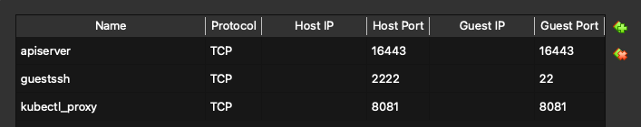
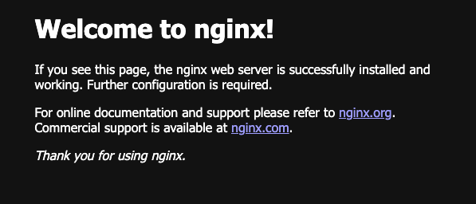
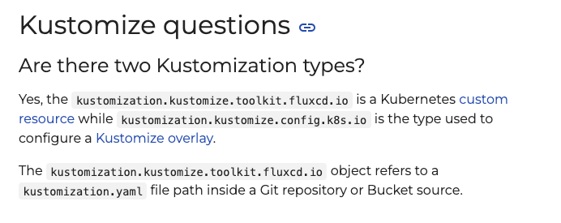

# Flux CD on k3s

## Motivation

Deploy nginx pods on k3s with Flux CD.

---
## Overview

1. Set up VM for the experiment.
2. Set up k3s cluster
3. Install Flux CLI on host
4. Create GitHub repo
5. Prepare deployment yaml files
6. Deploy FluxCD on k3s
7. Deploy nginx pods on k3s by FluxCD

---

## 1. Set up VM for the experiment.

We will recycle our usual Ubuntu server created by VirtualBox. 
See [another repo](https://github.com/megnergit/Microk8s_PostgreSQL_M1) of mine
to know how to start a VirtualBox machine. 

One note. Use NAT for the network. 

Make sure 'NAT' and 'NAT network' are different for VirtualBox machines. 
We will use 'NAT' here. 

VM with NAT network can reach out the **Internet** by default, but 
**host to VM** connection is disabled. 

In order to make the VM accessible from host via ssh and `kubectl`, we will 
set up  port forwarding.

On **host** (or VitrualBox Manager UI)
```sh
VBoxManage modifyvm "micro" --natpf1 "guestssh,tcp,,2222,,22"
VBoxManage modifyvm "micro" --natpf1 "apiserver,tcp,,16443,,6443"
```

 

## 2. Set up `k3s` cluster

Set up a `k3s` cluster on the VM that we have just started.

Do this on **VM**.
```sh
$ curl -sfL https://get.k3s.io | sh -
[INFO]  Finding release for channel stable
[INFO]  Using v1.31.5+k3s1 as release
...
[INFO]  systemd: Enabling k3s unit
Created symlink /etc/systemd/system/multi-user.target.wants/k3s.service → /etc/systemd/system/k3s.service.
[INFO]  systemd: Starting k3s
```

Check it.

```sh
systemctl list-units | grep k3s
```

In case of rollback, 

```sh
sudo /usr/local/bin/k3s-uninstall.sh
```


Make sure to evacuate `~/.kube/config` for `microk8s` and 
then copy the admin credential to your home directory, 

```sh
sudo cp /etc/rancher/k3s/k3s.yaml  $HOME/.kube/config
```

Edit the config, because we are accessing VM via port forwarding. 

```sh
server: https://127.0.0.1:6443 => server: https://127.0.0.1:16443
```

Change the permission of the  `config` file. 


```sh
sudo chown -R $USER:$USER .kube
```

Set an environmental variable so that `k3s` can find your credential.

```sh
export KUBECONFIG=$HOME/.kube/config
```

Test if we can access to the k3s cluster on VM.

```sh
$ kubectl get nodes
NAME    STATUS   ROLES                  AGE   VERSION
micro   Ready    control-plane,master   17m   v1.31.5+k3s1
```

All right. 


## 3. Install Flux CLI on host

There are `Flux`s working  in this project. 

a. `Flux` controllers to be installed on k3s as deployments.
b. `Flux` CLI to bootstrap the controllers above. 

In this section we will do 'b'. 


On **host**,

```sh
brew install fluxcd/tap/flux
```

Check

```sh
flux --version
```


Check further on **host**,

```sh
flux check --pre
► checking prerequisites
✔ Kubernetes 1.31.5+k3s1 >=1.30.0-0
✔ prerequisites checks passed
...
```

## 4. Create GitHub repo

Create a GitHub repo to push our yaml files for the deployment. 

Set up following environment variables for the later use 
at the bootstrapping. 

```sh
export GITHUB_TOKEN=<your-token>
export GITHUB_USER=<your-username>
export GITHUB_REPO=<the name of yoru repo>
```

The example may be

```sh

export GITHUB_TOKEN=github_pat_11A...d
export GITHUB_USER=megnergit
export GITHUB_REPO=fluxcd-k3s-f1
```

In case you would like to keep these variables, write them down in `~/.bashrc`.


Note: for GitHub, one cannot use 

- Capital letters
- Underscore

for the name of a repo (one can use them, but when you specify that name
to be referred by environmental variables, you have change all capital letters
to lower case, and replace '_' to '-').


5. Prepare deployment yaml files

Prepare the manifest files for the deployment. The directory structure looks like this. 

```sh
$ tree
.
├── LICENSE
├── README.md
└── clusters
    └── dev
        ├── apps
        │   └── nginx
        │       ├── deployment.yaml  # to deploy nginx pods
        │       └── service.yaml     # to create a service
        └── namespace.yaml           # to create a new namespace for nginx
```

For instance, 
```sh
$ cat namespace.yaml
apiVersion: v1
kind: Namespace
metadata:
  name: apps
```

In the future, when you have a production environment, 
you can create 'prod' parallel  to 'dev'.


6. Deploy `FluxCD` on `k3s`

Now we are ready to deploy `FluxCD` operators
on `k3s`.　Use `FluxCD` CLI on **host**,

```
flux bootstrap github \
  --owner=$GITHUB_USER \
  --repository=$GITHUB_REPO \
  --branch=main \
  --path=clusters/dev \
  --personal
```

`GITHUB_USER` and `GITHUB_REPO` are the environment
variables that we set when we make a new GitHub repo. 

The authentication will be done by the environment
variable `GITHUB_TOKEN`.

`--branch` is the GitHub branch that `FluxCD` should 
monitor.  

`--path` is the relative path to the manifest files
from the root of the repo. `FluxCD` will look at 
all directories under `./cluster/dev/` in this case,
to see if there are *.yaml files to apply in the cluster. 


Check if all controllers are created. Do this on **host**.

```
$ kubectl get deployment -n flux-system
NAME                      READY   UP-TO-DATE   AVAILABLE   AGE
helm-controller           1/1     1            1           55s
kustomize-controller      1/1     1            1           55s
notification-controller   1/1     1            1           55s
source-controller         1/1     1            1           55s
```

All right. 

7. Deploy nginx pods on `k3s` by `FluxCD`.

We will deploy nginx. 

```sh

git add .
git status
git commit -m "Test CD via FluxCD"
git push origin main
```

Check if the new namespace is created.

```
$ kubectl  get ns
NAME              STATUS   AGE
apps              Active   17h
....
```

```
$ kubectl get pods -n apps
NAME                     READY   STATUS    RESTARTS        AGE
nginx-54b9c68f67-2xzqq   1/1     Running   2 (8m35s ago)   17h
nginx-54b9c68f67-w2vj8   1/1     Running   2 (8m36s ago)   17h
```

All right. 

Check if nginx is running. 

First port-forward and link the port 80 of pods to the port 8080 of **host**. 
```
$ cat clusters/dev/apps/nginx/service.yaml
apiVersion: v1
kind: Service
metadata:
  name: nginx
...
```
In case that the name of the service resource is `nginx`, like above, 

```
$ kubectl port-forward svc/nginx 8080:80
```

Open `localhost:8080`.



All right. 

---
## Troubshooting and notes

1. There are two types `Kustomization` resources in `FluxCD` context. 

- Kubernetes native `kustomization` resource
that has api `kustomize.config.k8s.io`. 

- FluxCD config file when you want to start FluxCD controllers manually (as opposed to using bootstrap). 
The api used is `kustomize.toolkit.fluxcd.io`.

Both have same `kind: Kustomization`. 





2. Stop `microk8s`. 

Stop `microk8s` that was running on the VM before starting `k3s`.

```
$ microk8s stop
```

To restart `microk8s`


```
$ microk8s start


The components of  `microk8s` is running as a service. For instance, to see if 
API server is running or not,
```
$ sudo systemctl status snap.microk8s.daemon-apiserver
```

3. About `k3s`. 

`k3s` is managed by Rancher (=SUSE. `microk8s` is on the other hand 
maintained by Canonical, the official Ubuntu distributer).

The following tables are created by ChatGPT. 

| **Feature**           | **k3s** | **MicroK8s** | **Minikube** | **Vanilla Kubernetes** |
|----------------------|--------|------------|------------|-----------------|
| **Installation Complexity** | ✅ **Very Simple** (Single Binary) | ✅ **Simple** (Snap-based) | 🔹 **Moderate** (Requires VM) | ❌ **Complex** (Manual Setup Required) |
| **Resource Usage**   | ✅ **Low** (~512MB RAM) | 🔹 **Moderate** (~2GB) | 🔹 **Moderate** (~1GB) | ❌ **High** (~4GB+) |
| **Default Storage**  | **SQLite** (Default) | etcd (Standard) | etcd or other drivers | etcd |


Which Kubernetes Distribution to Choose?

| **Use Case** | **Recommended Distribution** |
|----------------|------------------------------|
| **Simple Local Development** | ✅ **Minikube** or **MicroK8s** |
| **Enterprise-Grade Production K8s** | ✅ **Vanilla Kubernetes** |
| **IoT, Edge, or Resource-Constrained Environments** | ✅ **K3s** |
| **Running on Raspberry Pi or Similar Devices** | ✅ **K3s** or **MicroK8s** |
| **K8s on Ubuntu (Simple Deployment)** | ✅ **MicroK8s** |

`k3s` Strengths & Weaknesses.

### **🔥 K3s Strengths**
✅ **Lightweight and Minimal Resource Usage (Best for IoT & Edge Computing)**
✅ **Simple Installation (`curl` one-liner)**
✅ **Built-in `Traefik` Ingress & `Flannel` CNI**
✅ **Single Binary Architecture (Easy to Manage)**

### **⚠️ K3s Weaknesses**
❌ **For High Availability, Vanilla Kubernetes is More Robust**
❌ **SQLite as Default Storage (Not Ideal for Large Clusters, Can Be Replaced with etcd)**
❌ **Not a Fully CNCF Standard Distribution (Rancher/SUSE Maintained)**


---


# END

